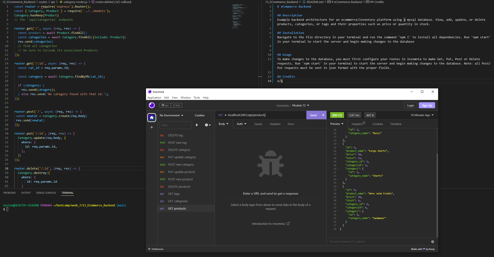

# eCommerce Backend

## Description
Example backend architecture for an ecommerce/inventory platform using a mysql database. View, add, update, or delete products, categories, or tags and their properties such as price or quantity in stock.

## Installation
Navigate to the file directory in your terminal and run the command 'npm i' to install all dependencies. Configure the .env file with your mysql credentials to connect to the database

## Usage 
To make changes to the database, you must first configure your routes in insomnia to make Get, Put, Post or Delete requests. Run 'npm start' in your terminal to start the server and begin making changes to the database. Note: all Post/Put requests must be sent in json format with the proper fields. 

[Link to Demo Video](https://drive.google.com/file/d/1ohmWSaNMCIzWCWe4G-YkyxeHPVE7c7AE/view)

## Credits
n/a